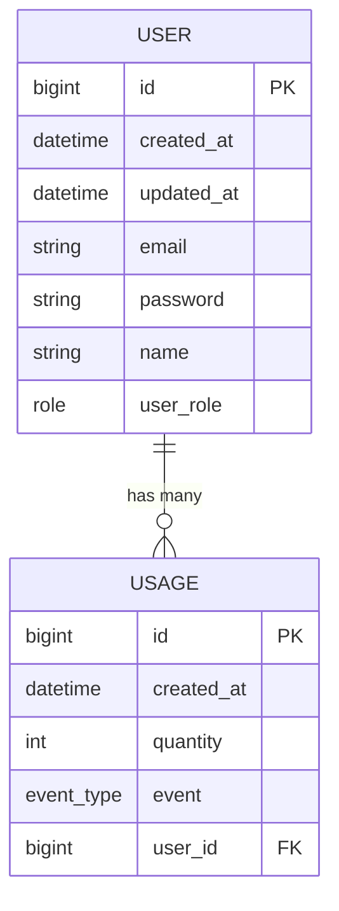
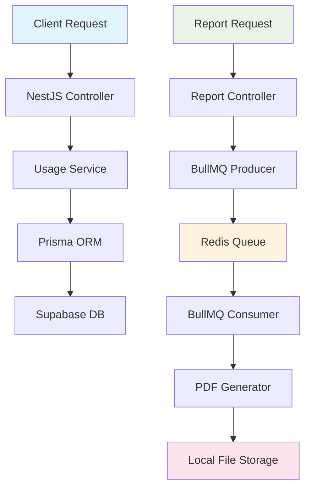
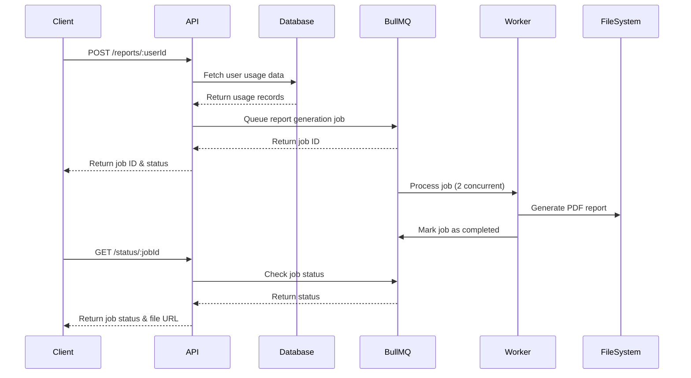

# 🚀 BizScout Billing Tracker

> A **scalable** and **robust** billing system with async job processing for usage tracking and report generation

---

## 🛠️ Local Development Setup

### Quick Start with Docker 🐳

```bash
# Build the container
docker build -t billing-tracker .

# Run the application
docker run -p 6009:6009 billing-tracker
```

🎉 **That's it!** Your application will be running on `http://localhost:6009`

---

## 🏗️ Architecture Overview

### System Design Philosophy

Our billing tracker follows a **microservice-ready** architecture with clear separation of concerns:

```
┌─────────────────┐    ┌──────────────┐    ┌─────────────────┐
│   NestJS API    │───▶│  PostgreSQL  │    │   Redis Store   │
│   (REST Layer)  │    │  (Supabase)  │    │  (BullMQ Jobs)  │
└─────────────────┘    └──────────────┘    └─────────────────┘
         │                                           │
         ▼                                           ▼
┌─────────────────┐                        ┌─────────────────┐
│ Usage Tracking  │                        │  Job Processing │
│   & Billing     │                        │   (2 Workers)   │
└─────────────────┘                        └─────────────────┘
                                                    │
                                                    ▼
                                          ┌─────────────────┐
                                          │  PDF Generator  │
                                          │  (Puppeteer)    │
                                          └─────────────────┘
```

### 🎯 Core Components

- **🌐 NestJS Backend**: Scalable server framework with SOLID principles
- **🗄️ Prisma ORM**: Type-safe database operations
- **🐘 Supabase**: PostgreSQL database with real-time capabilities
- **⚡ BullMQ**: Redis-based job queue for async processing
- **🔧 Redis**: Key-value store for job metadata
- **📄 Puppeteer**: PDF generation for usage reports
- **🧪 Jest**: Industry-standard unit testing

---

## 💡 Technology Choices & Reasoning

| Technology            | Why We Chose It                                         |
| --------------------- | ------------------------------------------------------- |
| **NestJS**            | 🎯 Mature, scalable framework enabling SOLID principles |
| **Prisma + Supabase** | 🚀 Simple, performant relational database operations    |
| **BullMQ**            | ⚡ Best-in-class job queue with Redis backing           |
| **Puppeteer**         | 📊 Mature, reliable PDF generation                      |
| **Jest**              | ✅ Industry standard for unit testing                   |
| **Class Validator**   | 🛡️ Robust input validation                              |

---

## 📊 Database Schema

### Entity Relationship Diagram



### 📋 Schema Details

**Users Table:**

- Primary entity for billing
- Role-based access (admin, manager, customer, provider)
- Timestamped for audit trails

**Usage Table:**

- Tracks API calls, VM uptime, CPU time, data storage
- Linked to users for billing calculations
- Indexed for fast queries

---

## 🔄 Data Flow Architecture



---

## 📚 API Documentation

### 🔗 Available Endpoints

| Method | Endpoint                        | Description           |
| ------ | ------------------------------- | --------------------- |
| `POST` | `/api/v1/usage/`                | Create usage record   |
| `GET`  | `/api/v1/usage/:id`             | Get usage by ID       |
| `POST` | `/api/v1/reports/:userId`       | Generate usage report |
| `GET`  | `/api/v1/reports/status/:jobId` | Check job status      |
| `GET`  | `/api/v1/health`                | Health check          |

### 📋 Example Requests

#### Create Usage Record

```json
POST /api/v1/usage/
{
    "quantity": 500000,
    "event": "api_calls",
    "user_id": 1
}
```

#### Generate Report

```json
POST /api/v1/reports/1
// Returns: { "jobId": "23", "status": "queued" }
```

#### Check Job Status

```json
GET /api/v1/reports/status/23
// Returns: { "status": "completed", "fileUrl": "/reports/user-1-report.pdf" }
```

**📎 Complete Postman Collection:** [Available in repository]

---

## ⚡ Async Workflow Design

### 🔄 Job Processing Pipeline



### 🎯 Job Types

1. **📊 Report Generation Jobs**

   - Fetch monthly usage data
   - Calculate billing amounts
   - Generate PDF reports
   - Store files locally

2. **⚙️ Processing Configuration**
   - **Concurrency**: 2 workers
   - **Queue Storage**: Redis
   - **Job Persistence**: Metadata stored in Redis

---

## ⚖️ Assumptions & Trade-offs

### 🔐 Security Considerations

- ⚠️ **No comprehensive authentication** implemented
- 🔄 **Trade-off**: Rapid development vs production security
- 💡 **Mitigation**: Planned for future iterations

### 🌐 Infrastructure Limitations

- 📊 **Free tier resources** (Render, Supabase)
- ⚡ **Trade-off**: Cost efficiency vs production scalability
- 🎯 **Impact**: Limited concurrent connections and storage

### 📁 File Storage

- 💾 **Local file storage** for PDF reports
- 🔄 **Trade-off**: Simplicity vs distributed storage
- 📈 **Scaling concern**: File management across instances

---

## 🚀 Future Improvements

### 🔒 Security Enhancements

- [ ] JWT-based authentication
- [ ] Role-based access control (RBAC)
- [ ] API rate limiting
- [ ] Input sanitization improvements

### 🏗️ Architecture Evolution

- [ ] **Microservices decomposition**
  - User service
  - Billing service
  - Report service
- [ ] **Event-driven architecture**
  - Event sourcing for usage tracking
  - CQRS for read/write optimization

### 📊 Scaling Strategies

- [ ] **Horizontal scaling**
  - Multiple worker instances
  - Load balancer integration
- [ ] **Database optimization**
  - Read replicas
  - Connection pooling
  - Query optimization

### 📈 Feature Roadmap

- [ ] **Enhanced reporting**
  - Real-time dashboards
  - Custom date ranges
  - Export formats (Excel, CSV)
- [ ] **Advanced billing**
  - Multiple pricing tiers
  - Usage quotas and alerts
  - Automated invoicing

---

## 🧪 Testing Strategy

### 🎯 Core Component Focus: **Billing Calculation Logic**

Our testing strategy prioritizes the most critical component - ensuring users are billed correctly.

#### 📊 Tiered Billing System Tests

```typescript
// Example: Testing tiered API call pricing
describe('Billing Calculation', () => {
  it('should apply correct tier pricing for API calls', () => {
    // Tier 1: 0-10k calls = $0.01 per call
    // Tier 2: 10k-100k calls = $0.008 per call
    // Tier 3: 100k+ calls = $0.005 per call

    expect(calculateCost(5000, 'api_calls')).toBe(50.0);
    expect(calculateCost(50000, 'api_calls')).toBe(420.0);
    expect(calculateCost(200000, 'api_calls')).toBe(1320.0);
  });
});
```

#### ✅ Test Categories

- **Unit Tests**: Billing calculation accuracy
- **Integration Tests**: End-to-end billing workflow
- **Edge Cases**: Boundary conditions and error handling

#### 🔧 CI/CD Pipeline

- **GitHub Actions**: Automated testing on every push
- **Linting**: ESLint + Prettier for code quality
- **Coverage**: Jest coverage reports
- **Docker**: Containerized testing environment

---

## 🏃‍♂️ Getting Started

1. **Clone the repository**
2. **Run with Docker** (see setup section above)
3. **Import Postman collection** for API testing
4. **Check health endpoint**: `GET /api/v1/health`

---

## 📞 Support

For questions or issues, please check the documentation or create an issue in the repository.

---

<div align="center">

**Built with ❤️ using NestJS, Prisma, and BullMQ**

_Scalable • Reliable • Developer-Friendly_

</div>
